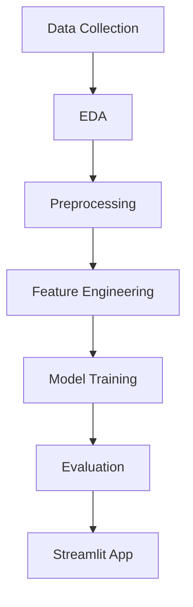

# 🚚 ShipmentSure – On-Time Delivery Prediction System

> 🎯 **Infosys Springboard Virtual Internship 6.0 –  Project**

---

## 🌟 Project Overview

**ShipmentSure** is an **end-to-end Machine Learning application** that predicts whether a shipment will be delivered **on time or delayed** using supplier and order-related data.

🚀 Built with **Python + Streamlit**, this project demonstrates:

* Real-world **supply chain analytics**
* Complete **ML lifecycle**
* **Interactive web deployment**

---

## 🧠 Problem Statement

Late deliveries can cause:

* Customer dissatisfaction 😕
* Revenue loss 💸
* Inefficient logistics 🚛

👉 **ShipmentSure** predicts **On-Time Delivery Probability** to help businesses take proactive decisions.

---

## 📊 Dataset Information

* 📌 **Source:** Kaggle – Supply Chain Logistics Dataset
* 📌 **Type:** Classification
* 📌 **Target Column:** `Reached.on.Time_Y.N`

  * `1` → On-Time
  * `0` → Delayed

---

## ⚙️ Tech Stack

| Layer              | Tools                                       |
| ------------------ | ------------------------------------------- |
| 🐍 Programming     | Python                                      |
| 📦 Data Processing | Pandas, NumPy                               |
| 📊 Visualization   | Matplotlib, Seaborn                         |
| 🤖 ML Models       | Logistic Regression, Random Forest, XGBoost |
| 🚀 Deployment      | **Streamlit**                               |

---

## 🔁 Project Workflow




---

## 🤖 Machine Learning Models

✅ Logistic Regression
✅ Random Forest
✅ XGBoost

📈 **Evaluation Metrics Used:**

* Accuracy
* Precision
* Recall
* F1-Score
* ROC-AUC
* Confusion Matrix
  


---

## 🖥️ Streamlit Web App

✨ Features:

* 📋 User-friendly input form
* 📊 Real-time prediction
* ⏱️ On-time delivery probability
* ⚡ Fast & interactive UI
  


---

## 📂 Repository Structure

```
📁 ShipmentSure
│
├── 📁 docs
│   ├── report.pdf
│   └── project_presentation.pptx
│
├── 📁 apps
│   └── app.py                 # Streamlit application
│
├── 📁 scripts
│   ├── eda.py
│   ├── preprocessing.py
│   ├── feature_engineering.py
│   ├── model_training.py
│   └── evaluation.py
│
├── final_training_dataset.xlsx
├── requirements.txt
└── README.md
```

---

## ▶️ How to Run the Project

### 🔹 Step 1: Clone the Repository

```bash
git clone https://github.com/your-username/ShipmentSure.git
cd ShipmentSure
```

### 🔹 Step 2: Install Dependencies

```bash
pip install -r requirements.txt
```

### 🔹 Step 3: Run Streamlit App

```bash
streamlit run apps/app.py
```

---

## 🎓 Internship Context

✅ Developed as part of
**🟢 Infosys Springboard Virtual Internship 6.0**

📌 This project fulfills:

* Industry-aligned ML use case
* Model evaluation & optimization
* Streamlit-based deployment
* Professional GitHub documentation

---

## 📈 Key Outcomes

✔️ Accurate shipment delivery prediction
✔️ Identification of delay-causing factors
✔️ Deployed ML web application
✔️ End-to-end project implementation


---

## 🙏 Acknowledgements

* **Infosys Springboard** for the internship opportunity
* **Kaggle** for the dataset
* **Streamlit** for rapid ML deployment

---

## 🌐 Connect

⭐ If you like this project, don’t forget to **star the repo**!

🔗 LinkedIn :-https://www.linkedin.com/in/pranav-dandge-95b7b2277/
💻 GitHub - https://github.com/Pranav08-cyber

---

🔥 **Built with data, ML, and passion for Infosys Springboard Virtual Internship 6.0** 🔥

---
